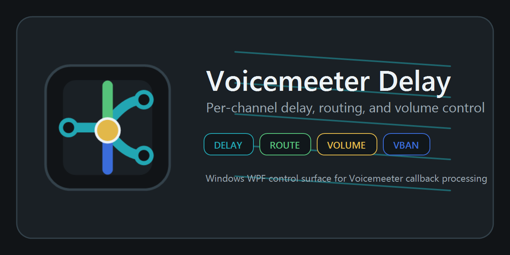

# VoicemeeterDelay



Small Windows WPF application that uses the Voicemeeter Remote API audio callback to delay audio samples.

Repository artwork is in `Assets`. Use `Assets/VoicemeeterDelaySocialPreview.png` as the GitHub repository social preview image.

## Requirements

- Windows x64
- .NET 8 SDK for building/debugging in Visual Studio
- Voicemeeter installed and running
- `VoicemeeterRemote64.dll` in the default Voicemeeter install path, beside the app, on `PATH`, or selected from the API fallback picker

## Visual Studio setup

1. Open Visual Studio Installer.
2. Install the **.NET desktop development** workload.
3. Open `VoicemeeterDelay.csproj` in Visual Studio.
4. Set the solution platform to `x64`.
5. Start Voicemeeter before running the app.
6. Press `F5` to debug, or `Ctrl+F5` to run without debugging.

The project targets `net8.0-windows`, uses WPF, and loads `VoicemeeterRemote64.dll` at runtime. It first tests the default Voicemeeter path under `Program Files (x86)\VB\Voicemeeter`. If the DLL is not found automatically, expand **API DLL fallback**, use Browse, and select it from the Voicemeeter install folder.

The app calls `VBVMR_GetVoicemeeterType` after logging in to the Remote API. It detects the running mixer as Standard, Banana, or Potato and trims the visible input/output buttons to the matching strip and bus layout.

## Build from PowerShell

```powershell
dotnet build .\VoicemeeterDelay.csproj -c Debug
```

## Publish Single EXE

Visual Studio can publish with the `win-x64-single-file` profile. From PowerShell:

```powershell
dotnet publish .\VoicemeeterDelay.csproj -c Release -r win-x64 -p:PublishProfile=win-x64-single-file
```

The publish profile creates a framework-dependent Windows x64 single-file executable, so the EXE stays small and the PC running it needs the .NET 8 Desktop Runtime installed. Voicemeeter still needs to be installed because the app loads the Voicemeeter Remote API DLL from the default install path, beside the app, on `PATH`, or from the saved fallback path.

## Publish To GitHub Releases

The repo includes a GitHub Actions workflow at `.github\workflows\release.yml`. To publish from GitHub, commit and push the project, then create and push a version tag:

```powershell
git tag v1.0.0
git push origin v1.0.0
```

The workflow publishes the Windows x64 single-file build and attaches both `VoicemeeterDelay-v1.0.0-win-x64.exe` and `VoicemeeterDelay-v1.0.0-win-x64.zip` to the GitHub Release.

You can also run the workflow manually from GitHub Actions with a tag value, or publish from this machine with GitHub CLI:

```powershell
gh auth login
.\scripts\Publish-GitHubRelease.ps1 -Tag v1.0.0
```

To build the release files without uploading them, run:

```powershell
.\scripts\Publish-GitHubRelease.ps1 -Tag v1.0.0 -NoUpload
```

Visual Studio also has a `GitHubRelease` publish profile. In Visual Studio, right-click the project, choose **Publish**, select **GitHubRelease**, and click **Publish**. The profile publishes the framework-dependent single-file EXE, packages it, and then calls `scripts\Publish-GitHubRelease.ps1` to create or update the GitHub Release.

The `GitHubRelease` profile uses `v$(Version)` as the release tag. To publish a different version, update the project `Version` property or edit `GitHubReleaseTag` in `Properties\PublishProfiles\GitHubRelease.pubxml`. The local repo needs a GitHub `origin` remote, or you can set `GitHubRepository` in that publish profile to `owner/repo`.

## Run

From Visual Studio, run the project and use the window controls.

From PowerShell:

```powershell
dotnet run --project .\VoicemeeterDelay.csproj
```

## MacroButtons VBAN Control

Enable **VBAN** in the main window to let MacroButtons send VBAN-TEXT commands into this app. For a same-PC setup, keep **Local only** enabled, set the app port to `6981`, and configure a MacroButtons VBAN-TEXT output slot such as `vban1` to send to `127.0.0.1`, port `6981`, with the same stream name shown in the app, for example `Command1` or `VDControl`.

For the full command reference, open [`VBAN_COMMANDS.md`](VBAN_COMMANDS.md) or use the **VBAN Commands** button inside the app. Release ZIP downloads include both `README.md` and `VBAN_COMMANDS.md`.

`vban1` is the MacroButtons output slot name. The stream name is configured inside that slot and must match the app's **Stream** field.

Commands follow Voicemeeter-style zero-based `Strip` / `Bus` syntax, namespaced with `VD.`:

```text
SendText("vban1", VD.Strip(0).Ch(1).Enable=1;);
SendText("vban1", VD.Strip(5).Ch(All).Delay=35;);
SendText("vban1", VD.Strip(6).Ch(1-2).Volume=90;);
SendText("vban1", VD.Bus(B1).Ch(1).Enable=1; VD.Bus(B1).Ch(1).Delay=25;);
SendText("vban1", VD.Strip(0).Ch(1).Route=Bus(B1).Ch(3););
SendText("vban1", VD.Strip(0).Ch(1).Route+=Bus(B2).Ch(4););
SendText("vban1", VD.Strip(0).Ch(1).MuteNormal=1;);
```

For Potato input strips, `Strip(0-4)` are Hardware In 1-5, `Strip(5)` is VAIO, `Strip(6)` is AUX, and `Strip(7)` is VAIO3. Bus labels such as `A1`, `A2`, `B1`, `B2`, and `B3` can be used directly.

For route commands, `Route=Bus(B1).Ch(3)` replaces the source channel's route list and enables routing, `Route+=Bus(B2).Ch(4)` adds another destination, and `Route-=Bus(B1).Ch(3)` removes that destination. `RouteEnable=0` disables routing without deleting saved destinations. `MuteNormal=1` silences the source channel's normal path while the route is active.

## Notes

- `Output` delays Voicemeeter bus/output insert channels before the master section.
- `Input` delays input insert channels before strip processing.
- `Main` is exposed for experimentation, but output/input insert modes are usually the practical choices for a pure delay.
- Pick `Input` or `Output`, then choose one strip/bus button.
- The header shows the detected running mixer edition: Standard, Banana, or Potato.
- Hardware inputs expose `L` and `R` channel strips.
- Virtual inputs and output buses expose 8 vertical channel strips.
- Each channel strip has its own enable checkbox, vertical delay slider, millisecond value, and volume percent control.
- Channel volume is relative to Voicemeeter's current level: `100%` is unity/no change, lower values attenuate, and higher values boost.
- Volume-only processing does not allocate an extra delay buffer, but the matching input/output callback side still has to be armed.
- Input channel strips also have optional routing controls. A route can send that input channel into one or more output bus channels, and can mute the source channel's normal path. Route processing is inactive unless a route checkbox is enabled.
- **Input floor** and **Output floor** are kept at `0 ms` by default so the faders show only the delay amount configured by the user.
- The toolbar floor box follows the selected side: open Input to edit the input floor, or Output to edit the output floor.
- Channel faders show total added delay: path floor plus any extra delay-line time. A checked fader at the bottom arms the callback path, but adds `0 ms` extra delay line.
- Use the mouse wheel on a slider to nudge it by 1 ms, or hold `Shift` while scrolling to nudge by 10 ms.
- Starting the app applies every configured per-channel input and output delay at the same time.
- Faders, volumes, channel enables, and input/output selections remain editable while running; changes are pushed live to the callback engine.
- Faders, volumes, enabled channel ticks, selected input/output, DLL fallback path, and hidden floor values are saved automatically and restored on the next launch. The engine waits for a tick/edit or command before arming, so Release startup stays conservative.
- Channel, route, delay, volume, and selected I/O state is saved in separate Standard, Banana, and Potato profiles. When the app detects a different running mixer edition, it switches to that edition's profile instead of carrying Potato-only strips/buses into Banana or Standard.
- The app only arms sides that have at least one enabled channel. While running, ticking a channel on a new side re-arms that side; unticking the last channel on a side removes that side.
- The API DLL fallback path is locked while running and requires stopping before changing it.
- The delay path writes delayed samples only; it is not an echo effect and does not add feedback.
- During delay-line priming, audio passes through until the buffer fills.
